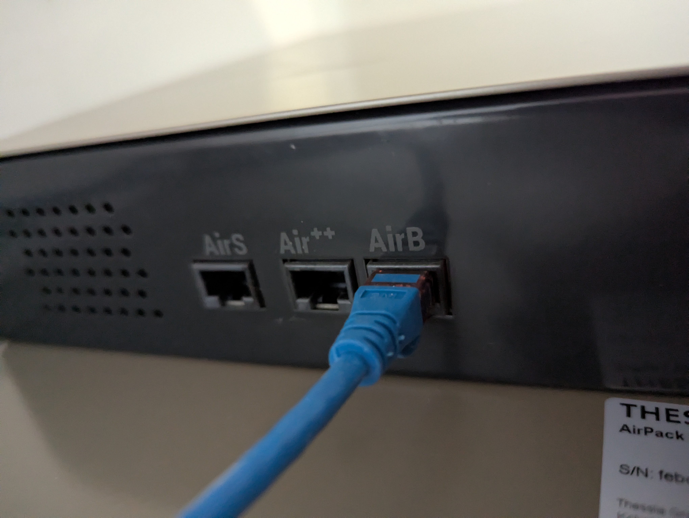
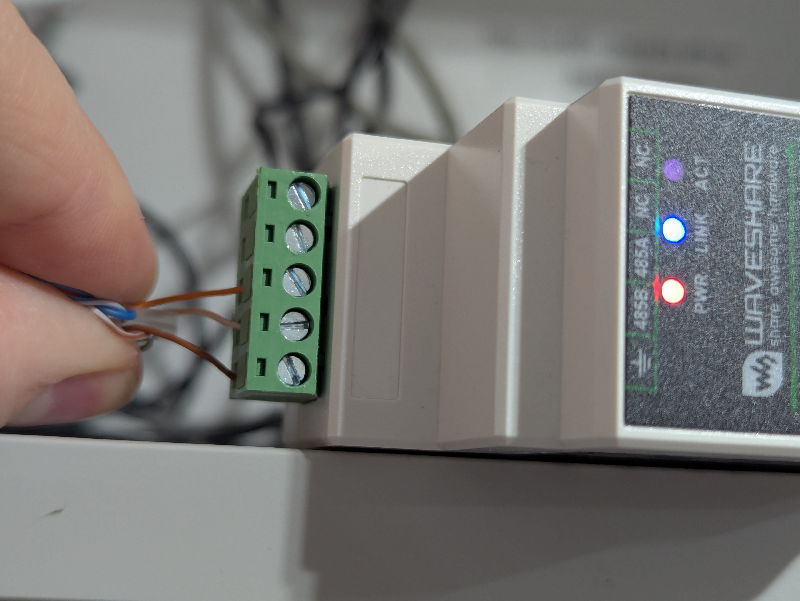
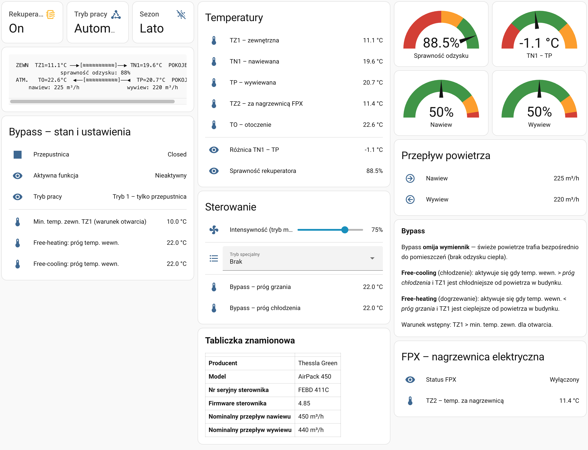

# Thessla Green AirPack — Home Assistant Integration

Custom integration for the **Thessla Green AirPack** HRV (Heat Recovery Ventilation) unit, communicating over **Modbus TCP** via an RS485-to-Ethernet gateway.

Tested with: **AirPack 450**, firmware **4.85**, gateway Waveshare RS485 to ETH (B).

---

## Hardware requirements

- Thessla Green AirPack unit with RS485 service port
- RS485 → Ethernet gateway (e.g. [Waveshare RS485 to ETH B](https://www.waveshare.com/rs485-to-eth-b.htm))
  - Mode: **TCP Server**, local port: **4196**
  - Baud: **19200**, Parity: **Even**, Data bits: **8**, Stop bits: **1**
  - Protocol: **None** (raw Modbus RTU over TCP)
- Gateway reachable from your Home Assistant host

---

## Wiring — AirPack to RS485 gateway

The AirPack exposes its RS485 bus through standard RJ45 jacks on the back panel. You can connect it to the Waveshare gateway using a regular Ethernet (Cat5e/Cat6) patch cable — RJ45 plug on the AirPack side, bare wires stripped and screwed into the gateway terminal block on the other end.

### AirPack side

Plug the RJ45 connector into the **AirB** port on the AirPack unit:

> The AirPack has three RJ45 ports: **AirS**, **Air++**, and **AirB**. Use the **AirB** port for Modbus communication.

### Gateway side (Waveshare RS485 to ETH)

Strip three wires from the other end of the Ethernet cable and connect them to the screw terminal block on the Waveshare gateway:

| Ethernet wire color | Gateway terminal | Function |
|---------------------|------------------|----------|
| Brown               | ⏚ (GND)         | Ground   |
| White-orange        | 485B             | RS485 B (−) |
| Orange              | 485A             | RS485 A (+) |

> Only 3 of the 8 wires in the Ethernet cable are used. The remaining wires can be left unconnected (NC terminals on the gateway).

---

## Entities

### Sensors (read-only)

| Entity | Description | Unit |
|--------|-------------|------|
| `sensor.rekuperator_tz1` | Outdoor / supply air temp (pre-HRV) | °C |
| `sensor.rekuperator_tn1` | Supply air temp (post-HRV) | °C |
| `sensor.rekuperator_tp` | Exhaust air temp (pre-HRV) | °C |
| `sensor.rekuperator_tz2` | FPX / pre-heater sensor temp | °C |
| `sensor.rekuperator_to` | Ambient (room) temperature | °C |
| `sensor.rekuperator_nawiew_procent` | Supply airflow | % |
| `sensor.rekuperator_wywiew_procent` | Exhaust airflow | % |
| `sensor.rekuperator_nawiew_m3h` | Supply airflow | m³/h |
| `sensor.rekuperator_wywiew_m3h` | Exhaust airflow | m³/h |
| `sensor.rekuperator_sprawnosc` | Heat recovery efficiency | % |
| `sensor.rekuperator_roznica_temperatur` | Supply − exhaust temperature delta | °C |
| `sensor.rekuperator_firmware` | Firmware version | — |
| `sensor.rekuperator_numer_seryjny` | Serial number | — |
| `sensor.rekuperator_model` | Model name | — |
| `sensor.rekuperator_bypass_status` | Bypass status | — |
| `sensor.rekuperator_bypass_tryb_opis` | Bypass mode description | — |
| `sensor.rekuperator_fpx_status` | FPX pre-heater status | — |
| `sensor.rekuperator_bypass_min_temp` | Bypass minimum outdoor temp | °C |
| `sensor.rekuperator_bypass_temp_grzanie` | Bypass free-heating threshold | °C |
| `sensor.rekuperator_bypass_temp_chlodzenie` | Bypass free-cooling threshold | °C |
| `sensor.rekuperator_nominal_nawiew` | Nominal supply airflow | m³/h |
| `sensor.rekuperator_nominal_wywiew` | Nominal exhaust airflow | m³/h |

### Binary sensors

| Entity | Description |
|--------|-------------|
| `binary_sensor.rekuperator_wlaczony` | Unit is running |
| `binary_sensor.rekuperator_zima` | Winter mode active |
| `binary_sensor.rekuperator_bypass_silownik` | Bypass actuator open |

### Switch

| Entity | Description |
|--------|-------------|
| `switch.rekuperator` | Main ON / OFF |

### Select (writable)

| Entity | Options |
|--------|---------|
| `select.rekuperator_tryb` | Automatyczny · Manualny · Chwilowy |
| `select.rekuperator_sezon` | Lato · Zima |
| `select.rekuperator_funkcje_specjalne` | Brak · Okap · Kominek · Wietrzenie (×6) · Otwarte okna · Pusty dom |

### Number (writable)

| Entity | Range | Step |
|--------|-------|------|
| `number.rekuperator_intensywnosc` | 10 – 100 % | 5 % |

---

## Installation

### Via HACS (recommended)

1. Open HACS → **Integrations** → three-dot menu → **Custom repositories**
2. Add `https://github.com/staszekj/eltrue-thessla-green-airpack-ha` with category **Integration**
3. Find and install **Thessla Green AirPack**
4. Restart Home Assistant

### Manual

Copy the `custom_components/eltrue_thessla_green_airpack_ha/` folder to your HA `config/custom_components/` directory and restart.

---

## Configuration

**Settings → Devices & Services → Add Integration → Thessla Green AirPack**

| Field | Default | Description |
|-------|---------|-------------|
| Gateway IP address | 192.168.3.29 | IP of the RS485 → ETH gateway |
| TCP port | 4196 | TCP listening port on the gateway |
| Modbus device ID | 10 | Modbus slave / unit ID of the AirPack |

---

## Register map

| Address | Access | Description | Scale / Notes |
|---------|--------|-------------|---------------|
| 16 – 22 | Input | Temperatures: TZ1, TN1, TP, TZ2, TN2, TZ3, TO | ×0.1 °C, signed int16, 32768 = no sensor |
| 272 – 275 | Input | Supply %, exhaust %, supply m³/h, exhaust m³/h | uint16 |
| 0 – 1 | Input | Firmware major, minor | uint16 |
| 24 – 27 | Input | Serial number words 1–4 | uint16 |
| 4192 | Holding | FPX flag (0 = off) | uint16 |
| 4198 | Holding | FPX mode (1 = frost protect, 2 = supply heating) | uint16 |
| 4208 | Holding | Mode (0 = Auto, 1 = Manual, 2 = Momentary) | uint16 |
| 4209 | Holding | Season (0 = Summer, 1 = Winter) | uint16 |
| 4210 | Holding | Manual intensity (%) | uint16 |
| 4224 | Holding | Special function (0–11) | uint16 |
| 4320 | Holding | Bypass disabled flag | uint16 |
| 4321 – 4323 | Holding | Bypass temps: min, heating, cooling | ×0.5 °C |
| 4330 | Holding | Bypass status (0=inactive, 1=heating, 2=cooling) | uint16 |
| 4331 | Holding | Bypass mode (1–3) | uint16 |
| 4354 – 4355 | Holding | Nominal supply / exhaust airflow | m³/h |
| 4387 | Holding | ON / OFF (1 = on, 0 = off) | uint16 |
| 9 | Coil | Bypass actuator | bool |

---

## Dashboard cards

A ready-to-use Lovelace dashboard is included in [`lovelace-example.yaml`](lovelace-example.yaml).

It provides:
- **Status bar** — ON/OFF switch, operating mode, season selector
- **Heat exchanger diagram** — live ASCII-art schematic with temperatures, efficiency, and airflow
- **Gauges** — heat recovery efficiency, temperature delta, supply/exhaust airflow %
- **Temperature list** — all 5 temperature sensors + computed delta and efficiency
- **Controls** — manual intensity slider, special function selector, bypass thresholds
- **Bypass section** — actuator state, active function, mode, threshold temperatures
- **FPX pre-heater** — status and post-heater temperature
- **Device nameplate** — manufacturer, model, serial, firmware, nominal airflows

### Preview

### How to add the cards

**Option A — Add as a new view (recommended):**

1. Open your dashboard → **Edit** → three-dot menu → **Raw configuration editor**
2. Scroll to the `views:` section
3. Paste the entire content of `lovelace-example.yaml` as a new entry under `views:`
4. Save

**Option B — Add individual cards:**

1. Open your dashboard → **Edit** → **Add Card** → **Manual**
2. Copy one `- type:` block from `lovelace-example.yaml`
3. Paste into the YAML editor
4. Repeat for each card

> **Note:** Entity names assume the default `rekuperator` prefix. If you changed the device name during integration setup, adjust entity_id prefixes accordingly.

---

## Tested hardware

- Thessla Green **AirPack 450**, firmware 4.85
- Waveshare **RS485 to ETH B** gateway

---

## Contributing

Pull requests and issue reports are welcome. Please open an issue before submitting a PR for larger changes.

---

## License

[MIT](LICENSE)
